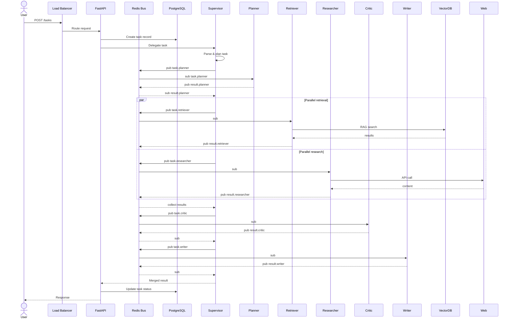
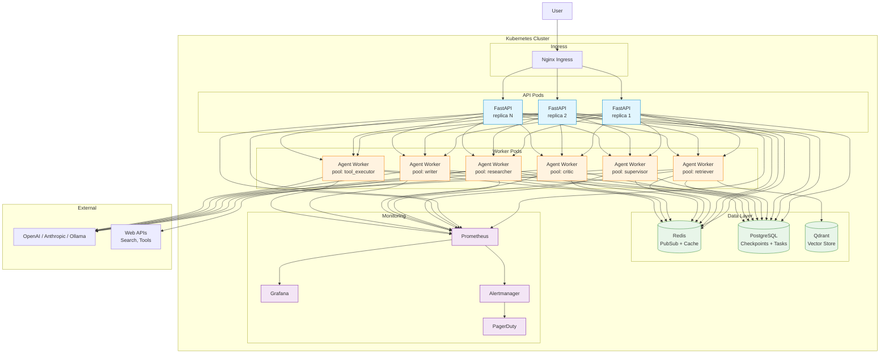

# Multi-Agent System — Design Document

## Overview

A coordinated multi-agent system with specialized agents for retrieval, reasoning, critique, and tool orchestration. Agents communicate via an async message bus, coordinate through pluggable patterns (sequential, hierarchical, voting, debate, auction), and share state via a persistent state machine. This project demonstrates how distributed system design skills — service topology, message passing, state management, fault tolerance — transfer directly to multi-agent AI architectures.

**Skills demonstrated: Distributed system design — Agent state management — Multi-agent coordination**

| Enterprise Distributed System | AI Multi-Agent Equivalent | This Project |
|---|---|---|
| **Service discovery + registry** | Agent registry with health checks | AgentRegistry: heartbeat, capability advertisement, automatic de-registration |
| **Message queue / event bus** | Inter-agent communication bus | Async PubSub message bus (in-memory + Redis) with typed message schemas |
| **State machine / saga pattern** | Agent state graph + checkpointing | LangGraph-inspired state machine with per-node state, global context, and PostgreSQL checkpoints |
| **Circuit breaker + bulkhead** | Agent timeout, retry, fallback | Timeout per agent step, retry with exponential backoff, fallback agent, circuit breaker on consecutive failures |
| **Load balancing** | Task routing to capable agents | Auction pattern: agents bid on tasks; supervisor routes to best-fit agent |
| **Distributed tracing** | Agent execution trace | Request ID waterfall across agents with timing, token counts, and tool calls |

---

## Architecture

```
                          ┌──────────────────────┐
                          │      User Request     │
                          └──────────┬───────────┘
                                     │
                                     ▼
                    ┌────────────────────────────────┐
                    │         Supervisor Agent        │
                    │   - Parses request              │
                    │   - Selects coordination mode   │
                    │   - Routes to workers           │
                    │   - Merges results              │
                    └────┬───────────────────────┬───┘
                         │                       │
               ┌─────────▼─────────┐   ┌─────────▼─────────┐
               │                   │   │                   │
               ▼                   ▼   ▼                   ▼
        ┌──────────────────────────────────────────────────────┐
        │                  Agent Pool                           │
        │                                                       │
        │  ┌────────────┐  ┌────────────┐  ┌───────────────┐  │
        │  │  Retriever  │  │ Researcher │  │   Critic      │  │
        │  │  Agent     │  │  Agent     │  │   Agent       │  │
        │  │  (RAG)     │  │  (search)  │  │   (eval)      │  │
        │  └────────────┘  └────────────┘  └───────────────┘  │
        │                                                       │
        │  ┌────────────┐  ┌────────────┐  ┌───────────────┐  │
        │  │   Writer   │  │Tool Exec.  │  │   Planner     │  │
        │  │  Agent     │  │  Agent     │  │   Agent       │  │
        │  │ (synthesis)│  │ (API/DB)   │  │  (decompose)  │  │
        │  └────────────┘  └────────────┘  └───────────────┘  │
        └──────────────────────┬──────────────────────────────┘
                               │
                               ▼
        ┌──────────────────────────────────────────────────────┐
        │                  Shared Infrastructure                │
        │                                                       │
        │  ┌────────────┐  ┌────────────┐  ┌───────────────┐  │
        │  │ Message    │  │   State    │  │  Tool         │  │
        │  │ Bus        │  │   Machine  │  │  Registry     │  │
        │  │ (PubSub)   │  │   (graph)  │  │  (discovery)  │  │
        │  └────────────┘  └────────────┘  └───────────────┘  │
        │                                                       │
        │  ┌────────────┐  ┌────────────┐  ┌───────────────┐  │
        │  │  Memory    │  │ Checkpoint │  │  Context      │  │
        │  │  Store     │  │  Store     │  │  Manager      │  │
        │  │ (agent+    │  │ (Postgres) │  │  (token       │  │
        │  │  shared)   │  │            │  │  budget)      │  │
        │  └────────────┘  └────────────┘  └───────────────┘  │
        └──────────────────────────────────────────────────────┘
```

### Agent Lifecycle

```
┌──────────┐   ┌──────────┐   ┌──────────┐   ┌────────────┐
│  INIT    │──►│  THINK   │──►│   ACT    │──►│  OBSERVE   │──► repeat
│  Receive │   │  LLM     │   │  Tool    │   │  Process   │
│  task    │   │  decide  │   │  call    │   │  result    │
└──────────┘   └──────────┘   └──────────┘   └────────────┘
                    │                              │
                    │ (if no tool needed)           │ (if done)
                    ▼                              ▼
              ┌──────────┐                  ┌────────────┐
              │  RETURN  │                  │   RETURN   │
              │  Final   │                  │  Result    │
              │  answer  │                  │            │
              └──────────┘                  └────────────┘
```

---

## Project Structure

```
projects/multi-agent-system/
├── app/
│   ├── __init__.py
│   ├── config.py                    # Settings via pydantic-settings
│   ├── schemas.py                   # Pydantic models for messages, tasks, states
│   │
│   ├── agents/
│   │   ├── __init__.py
│   │   ├── base.py                  # Abstract BaseAgent with lifecycle
│   │   ├── registry.py              # Agent discovery + health checks + capabilities
│   │   ├── supervisor.py            # Orchestrator: parse, route, merge, return
│   │   ├── researcher.py            # Web search via Tavily / Bing API
│   │   ├── retriever.py             # RAG over vector store (reuses project #2)
│   │   ├── critic.py                # Evaluate output: faithfulness, relevance, safety
│   │   ├── writer.py                # Synthesize final response from collected data
│   │   ├── tool_executor.py         # Execute REST API calls, DB queries, code
│   │   └── planner.py               # Decompose complex tasks into sub-tasks
│   │
│   ├── communication/
│   │   ├── __init__.py
│   │   ├── bus.py                   # Async PubSub message bus (in-memory + Redis)
│   │   ├── protocols.py             # Message schemas: TaskMessage, ResultMessage, QueryMessage, BroadcastMessage
│   │   └── serialization.py         # Message serialization + schema validation
│   │
│   ├── coordination/
│   │   ├── __init__.py
│   │   ├── base.py                  # Abstract CoordinationStrategy
│   │   ├── sequential.py            # Chain: agent A → B → C, each passing output as next input
│   │   ├── hierarchical.py          # Supervisor delegates sub-tasks, workers return, supervisor merges
│   │   ├── voting.py                # N agents generate answers → vote or rank → pick best
│   │   ├── debate.py                # Agents argue in rounds, refine positions, converge
│   │   └── auction.py               # Agents bid on tasks based on capability match; supervisor awards
│   │
│   ├── state/
│   │   ├── __init__.py
│   │   ├── machine.py               # LangGraph-inspired state machine: graph of nodes + edges
│   │   ├── memory.py                # Per-agent scratchpad + shared global memory
│   │   ├── checkpoint.py            # State persistence to PostgreSQL + recovery
│   │   └── context.py               # Shared context window + token budget manager
│   │
│   ├── tools/
│   │   ├── __init__.py
│   │   ├── registry.py              # Tool discovery + schema + auth + rate limiting
│   │   ├── web_search.py            # Tavily / Bing Search API tool
│   │   ├── calculator.py            # Python code interpreter (sandboxed)
│   │   ├── vector_search.py         # RAG search over vector store
│   │   └── api_call.py              # Generic REST API tool with OpenAPI spec parsing
│   │
│   └── api/
│       ├── __init__.py
│       ├── routes.py                # FastAPI: run task, agent status, conversation, streaming
│       └── dependencies.py
│
├── tests/
│   ├── __init__.py
│   ├── conftest.py
│   ├── test_supervisor.py
│   ├── test_coordination.py
│   ├── test_state_machine.py
│   ├── test_communication.py
│   └── test_tools.py
│
├── data/
│   └── sample_tasks.jsonl           # Sample task definitions for testing
│
├── notebooks/
│   └── explore_agents.ipynb
├── docker-compose.yml               # FastAPI + Redis + PostgreSQL
├── Dockerfile
├── requirements.txt
└── README.md
```

---

## Agents

### Agent Interface

```python
class BaseAgent(ABC):
    name: str
    description: str
    capabilities: list[str]          # e.g., ["retrieval", "reasoning", "code_execution"]
    llm_config: LLMConfig

    @abstractmethod
    async def think(self, task: Task, context: Context) -> Thought:
        """LLM call: decide what to do next based on task + context."""

    @abstractmethod
    async def act(self, thought: Thought) -> ActionResult:
        """Execute the decided action (tool call, sub-tasks, or final answer)."""

    @abstractmethod
    async def observe(self, result: ActionResult, context: Context) -> Observation:
        """Process the action result, update context, decide to repeat or return."""

    async def run(self, task: Task, context: Context) -> AgentResult:
        """Full lifecycle: think → act → observe (loop until done)."""
        while not task.completed:
            thought = await self.think(task, context)
            if thought.action_type == "final_answer":
                return AgentResult(answer=thought.content, agent=self.name)
            result = await self.act(thought)
            observation = await self.observe(result, context)
            context.add_step(self.name, thought, result, observation)
        return AgentResult(answer=context.get_final(), agent=self.name)
```

### Agent Types

| Agent | Capabilities | LLM | Tools | When Used |
|---|---|---|---|---|
| **Supervisor** | planning, routing, merging | GPT-4o | none (orchestrates agents) | Always — entry point for every request |
| **Planner** | task decomposition | GPT-4o | none | Complex multi-step requests |
| **Retriever** | RAG, vector search | GPT-4o-mini | vector_search | Questions requiring document context |
| **Researcher** | web search, fact-checking | GPT-4o-mini | web_search | Current events, external information |
| **Critic** | evaluation, QA | GPT-4o | none | Verify outputs before delivery |
| **Writer** | synthesis, formatting | GPT-4o-mini | none | Merge collected info into polished response |
| **Tool Executor** | API calls, code | GPT-4o-mini | calculator, api_call | Calculations, data fetching, transformations |

---

## Communication

### Message Bus

```python
class MessageBus:
    """
    Async PubSub message bus for inter-agent communication.
    Supports: point-to-point, broadcast, request-response patterns.
    Backed by in-memory asyncio.Queue for dev, Redis PubSub for production.
    """
    def __init__(self, backend: str = "memory", redis_url: str | None = None):
        self.subscribers: dict[str, list[Callable]] = {}
        self.history: list[Message] = []

    async def publish(self, topic: str, message: Message):
        """Publish a message to all subscribers of this topic."""
        self.history.append(message)
        for callback in self.subscribers.get(topic, []):
            asyncio.create_task(callback(message))

    async def request(self, target_agent: str, message: TaskMessage, timeout: float = 30.0) -> ResultMessage:
        """Send a request and wait for response (request-response pattern)."""
        response_future = asyncio.get_event_loop().create_future()
        async def on_response(msg: ResultMessage):
            if msg.in_response_to == message.id:
                response_future.set_result(msg)
        await self.subscribe(f"response.{target_agent}", on_response)
        await self.publish(f"agent.{target_agent}", message)
        try:
            return await asyncio.wait_for(response_future, timeout)
        except asyncio.TimeoutError:
            raise AgentTimeoutError(target_agent, timeout)

    def subscribe(self, topic: str, callback: Callable):
        """Register a callback for messages on this topic."""
        if topic not in self.subscribers:
            self.subscribers[topic] = []
        self.subscribers[topic].append(callback)
```

### Message Schemas

```python
class Message(BaseModel):
    id: str = Field(default_factory=lambda: str(uuid.uuid4()))
    type: Literal["task", "result", "query", "broadcast", "error"]
    source: str                                 # agent name
    target: str | None                          # None = broadcast
    payload: dict
    in_response_to: str | None = None
    ttl_seconds: int = 60
    metadata: dict = {}                         # trace_id, token_count, latency

class TaskMessage(Message):
    type: Literal["task"] = "task"
    payload: Task

class ResultMessage(Message):
    type: Literal["result"] = "result"
    payload: AgentResult

class ErrorMessage(Message):
    type: Literal["error"] = "error"
    payload: dict                              # error_type, message, details
```

---

## Coordination Patterns

### Pattern Interface

```python
class CoordinationStrategy(ABC):
    name: str

    @abstractmethod
    async def execute(
        self,
        task: Task,
        agents: dict[str, BaseAgent],
        bus: MessageBus,
        context: Context,
    ) -> TaskResult:
        ...
```

### 1. Sequential

```
User ──► Agent A ──► Agent B ──► Agent C ──► Response
```

```python
class SequentialStrategy(CoordinationStrategy):
    """Chain of agents: output of one is input to the next."""
    def __init__(self, pipeline: list[str]):
        self.pipeline = pipeline          # Ordered list of agent names

    async def execute(self, task, agents, bus, context):
        current_task = task
        for agent_name in self.pipeline:
            agent = agents[agent_name]
            result = await agent.run(current_task, context)
            context.add_result(agent_name, result)
            current_task = Task(query=result.answer, parent_id=task.id)
        return TaskResult(answer=current_task.query, context=context)
```

**Best for:** Well-defined processing pipelines (retrieve → critique → write)

### 2. Hierarchical (Supervisor + Workers)

```
         ┌────────────── Supervisor ──────────────┐
         │ parse, decompose, route, merge          │
         └────┬──────┬──────┬──────┬──────────────┘
              │      │      │      │
              ▼      ▼      ▼      ▼
          Retriever Researcher Critic Writer
```

```python
class HierarchicalStrategy(CoordinationStrategy):
    """Supervisor decomposes, delegates to workers, merges results."""
    async def execute(self, task, agents, bus, context):
        supervisor = agents["supervisor"]
        # 1. Supervisor plans: decompose task into sub-tasks
        plan = await supervisor.think(task, context)
        # 2. Assign sub-tasks to workers
        worker_results = []
        for sub_task in plan.sub_tasks:
            worker = agents[sub_task.assigned_agent]
            result = await worker.run(sub_task, context)
            worker_results.append(result)
        # 3. Supervisor merges
        merged = await supervisor.merge(worker_results, context)
        return TaskResult(answer=merged, context=context)
```

**Best for:** Complex tasks with clearly separable sub-problems

### 3. Voting

```
         ┌────────────────────────────────────────┐
         │  Agent A ─────► Answer A               │
         │  Agent B ─────► Answer B               │► Rank/Vote ──► Best Answer
         │  Agent C ─────► Answer C               │
         └────────────────────────────────────────┘
```

```python
class VotingStrategy(CoordinationStrategy):
    """Multiple agents generate answers independently → rank → pick best."""
    def __init__(self, voters: list[str], num_answers: int = 3):
        self.voters = voters
        self.num_answers = num_answers

    async def execute(self, task, agents, bus, context):
        # 1. Each voter generates an answer
        results = await asyncio.gather(*[
            agents[name].run(task, context) for name in self.voters
        ])
        # 2. Critic ranks answers
        critic = agents["critic"]
        ranked = await critic.rank(
            [(r.answer, r.agent) for r in results],
            criteria=["faithfulness", "completeness", "relevance"],
        )
        return TaskResult(answer=ranked[0].answer, runner_up=ranked[1].answer, context=context)
```

**Best for:** Open-ended questions where diverse perspectives add value

### 4. Debate

```
Round 1: A argues position, B argues counter, C refines
Round 2: A rebuts B's points, B rebuts A's points, C synthesizes
Round N: Convergence or moderator (critic) decides
```

```python
class DebateStrategy(CoordinationStrategy):
    """Agents debate in rounds, refining positions until convergence."""
    def __init__(self, debaters: list[str], max_rounds: int = 3):
        self.debaters = debaters
        self.max_rounds = max_rounds

    async def execute(self, task, agents, bus, context):
        debate_log = []
        for round_num in range(self.max_rounds):
            round_answers = []
            for name in self.debaters:
                debate_context = context.with_debate_history(debate_log)
                result = await agents[name].run(task, debate_context)
                round_answers.append({"agent": name, "answer": result.answer})
            debate_log.append({"round": round_num, "answers": round_answers})
            # Convergence check by critic
            if round_num > 0:
                critic = agents["critic"]
                if await critic.has_converged(round_answers, debate_log[-2]["answers"]):
                    break
        return TaskResult(
            answer=debate_log[-1]["answers"][0]["answer"],
            debate_log=debate_log,
            context=context,
        )
```

**Best for:** Controversial or ambiguous topics requiring reasoning transparency

### 5. Auction

```
Task ──► Broadcast to all agents
         Agent A bids: capability match 0.9, cost $0.02
         Agent B bids: capability match 0.7, cost $0.01
         Agent C bids: capability match 0.95, cost $0.05
Supervisor awards task to highest score(capability, cost, availability)
```

```python
class AuctionStrategy(CoordinationStrategy):
    """Agents bid on tasks based on capability match; supervisor awards."""
    async def execute(self, task, agents, bus, context):
        # 1. Broadcast task to all agents
        bids = []
        for name, agent in agents.items():
            if name == "supervisor":
                continue
            match = await agent.evaluate_capability(task)
            if match > 0.5:  # Only bid if capable
                bids.append({"agent": name, "match": match, "cost": agent.llm_config.cost_per_call})
        # 2. Score bids: weighted combination of match, cost, and availability
        scored_bids = [
            {**b, "score": b["match"] * 0.6 + (1 - b["cost"] / max_cost) * 0.3 + availability * 0.1}
            for b in bids
        ]
        winner = max(scored_bids, key=lambda b: b["score"])
        # 3. Award task to winner
        result = await agents[winner["agent"]].run(task, context)
        return TaskResult(answer=result.answer, awarded_to=winner["agent"], score=winner["score"], context=context)
```

**Best for:** Heterogeneous agent pools with varying capabilities and costs

### Pattern Comparison

| Pattern | Complexity | Latency | Quality | Cost | Transparency | Best Use Case |
|---|---|---|---|---|---|---|
| Sequential | Low | Low | Medium | Low | High | Fixed processing pipelines |
| Hierarchical | Medium | Medium | High | Medium | High | Multi-step research tasks |
| Voting | Medium | Medium | High | High | Medium | Fact-checking, consensus |
| Debate | High | High | Highest | Highest | High | Controversial topics |
| Auction | High | Medium | High | Low–Med | Low | Heterogeneous agent pools |

---

## State Machine

### Graph Definition

```python
class StateGraph:
    """
    LangGraph-inspired state machine.
    Nodes = agents, Edges = transitions with conditions.
    State is a Pydantic model passed through the graph.
    """
    def __init__(self, state_schema: type[BaseModel]):
        self.state_schema = state_schema
        self.nodes: dict[str, Node] = {}
        self.edges: list[Edge] = []
        self.entry_point: str | None = None

    def add_node(self, name: str, agent: BaseAgent):
        self.nodes[name] = Node(name=name, agent=agent)

    def add_edge(self, from_node: str, to_node: str, condition: Callable[[BaseModel], bool] | None = None):
        self.edges.append(Edge(from_node=from_node, to_node=to_node, condition=condition))

    def set_entry_point(self, node: str):
        self.entry_point = node

    async def run(self, initial_state: BaseModel) -> BaseModel:
        current = self.entry_point
        state = initial_state
        while current:
            node = self.nodes[current]
            state = await node.agent.run(state)
            next_node = None
            for edge in self.edges:
                if edge.from_node == current:
                    if edge.condition is None or edge.condition(state):
                        next_node = edge.to_node
                        break
            current = next_node
        return state
```

### Example: Research Task Graph

```
                ┌──────────────┐
                │   Supervisor │ (entry)
                │  parse task  │
                └──────┬───────┘
                       │
                       ▼
                ┌──────────────┐
                │   Planner    │
                │  decompose   │
                └──────┬───────┘
                       │
              ┌────────┴────────┐
              ▼                 ▼
        ┌──────────┐    ┌──────────┐
        │Retriever │    │Researcher│
        │(internal)│    │(web)     │
        └────┬─────┘    └────┬─────┘
             └──────┬────────┘
                    ▼
              ┌──────────┐
              │  Critic  │
              │ evaluate │
              └────┬─────┘
                   │
              ┌────▼────┐
              │  Writer │
              │synthesize│
              └────┬─────┘
                   │
              ┌────▼────┐
              │Return   │ (final)
              └─────────┘
```

---

## Shared Context

### Context Manager

```python
class ContextManager:
    """
    Manages the shared context across all agents in a task.
    Includes: conversation history, per-agent scratchpads, token budget.
    """
    def __init__(self, max_tokens: int = 8000):
        self.max_tokens = max_tokens
        self.global_memory: list[MemoryEntry] = []
        self.agent_scratchpads: dict[str, list[str]] = {}
        self.token_usage: dict[str, int] = {}

    def add_global(self, entry: MemoryEntry):
        """Add to shared context visible to all agents."""
        self.global_memory.append(entry)
        self._trim_to_budget()

    def add_scratchpad(self, agent: str, entry: str):
        """Add to agent's private scratchpad (not shared)."""
        if agent not in self.agent_scratchpads:
            self.agent_scratchpads[agent] = []
        self.agent_scratchpads[agent].append(entry)
        self._trim_scratchpad(agent)

    def build_prompt(self, agent: str, task: Task) -> str:
        """Build the full LLM prompt: task + global context + agent's scratchpad."""
        parts = [
            f"Task: {task.query}",
            "\nShared Context:",
            *[f"- {e.content}" for e in self.global_memory[-10:]],
            f"\nYour Notes ({agent}):",
            *[f"- {n}" for n in self.agent_scratchpads.get(agent, [])[-5:]],
        ]
        return "\n".join(parts)

    def _trim_to_budget(self):
        """Remove oldest global entries until under token budget."""
        while count_tokens(str(self.global_memory)) > self.max_tokens * 0.7:
            self.global_memory.pop(0)
```

### Checkpointing

```python
class Checkpointer:
    """
    Persists agent state after each step for recovery and audit.
    """
    def __init__(self, db: Database):
        self.db = db

    async def save(self, task_id: str, step: int, agent: str, state: dict):
        await self.db.execute(
            "INSERT INTO checkpoints (task_id, step, agent, state, timestamp) VALUES (?, ?, ?, ?, ?)",
            (task_id, step, agent, json.dumps(state), datetime.utcnow()),
        )

    async def load_latest(self, task_id: str) -> dict | None:
        row = await self.db.query_one(
            "SELECT state FROM checkpoints WHERE task_id = ? ORDER BY step DESC LIMIT 1",
            (task_id,),
        )
        return json.loads(row.state) if row else None
```

---

## Tools

### Tool Registry

```python
class ToolRegistry:
    def __init__(self):
        self.tools: dict[str, Tool] = {}

    def register(self, tool: Tool):
        """Register a tool with its schema and auth."""
        self.tools[tool.name] = tool

    def get_schemas(self, agent_capabilities: list[str]) -> list[dict]:
        """Return tool schemas compatible with the agent's capabilities."""
        return [
            {"name": t.name, "description": t.description, "parameters": t.openapi_schema}
            for t in self.tools.values()
            if any(cap in t.required_capabilities for cap in agent_capabilities)
        ]

    async def execute(self, tool_name: str, params: dict, auth: dict) -> ToolResult:
        tool = self.tools[tool_name]
        async with tool.rate_limiter:
            result = await tool.execute(params, auth)
        return result
```

| Tool | Capability Required | Rate Limit | Auth |
|---|---|---|---|
| `web_search` | research | 30 req/min | API key (env) |
| `vector_search` | retrieval | 100 req/min | Internal only |
| `calculator` | code_execution | 10 req/min | Sandboxed |
| `api_call` | tool_use | Configurable | Per-service credential |

---

## Fault Tolerance

| Failure Mode | Detection | Mitigation |
|---|---|---|
| **Agent timeout** | `asyncio.wait_for` with per-step timeout | Retry with backoff (1s → 2s → 4s), then fallback to simpler agent |
| **LLM API error** | HTTP 5xx, rate limit | Provider failover (OpenAI → Anthropic → local) |
| **Tool failure** | Exception from tool execution | Retry once, then skip tool, flag in context |
| **Message loss** | Missing expected response | Re-publish with new TTL, supervisor checks message history |
| **State corruption** | Schema validation error on checkpoint load | Load previous checkpoint, re-run from last valid state |
| **Deadlock / infinite loop** | Agent repeating same action > 3 times | Circuit breaker: force-return current context, escalate to supervisor |

```python
class CircuitBreaker:
    def __init__(self, max_failures: int = 3, reset_seconds: int = 60):
        self.failures: dict[str, int] = {}
        self.open_since: dict[str, datetime] = {}
        self.max_failures = max_failures
        self.reset_seconds = reset_seconds

    async def call(self, agent_name: str, fn: Callable) -> Any:
        if self.is_open(agent_name):
            raise CircuitBreakerOpenError(agent_name)
        try:
            result = await fn()
            self.failures[agent_name] = 0
            return result
        except Exception:
            self.failures[agent_name] = self.failures.get(agent_name, 0) + 1
            if self.failures[agent_name] >= self.max_failures:
                self.open_since[agent_name] = datetime.utcnow()
            raise

    def is_open(self, agent_name: str) -> bool:
        if agent_name not in self.open_since:
            return False
        if (datetime.utcnow() - self.open_since[agent_name]).seconds > self.reset_seconds:
            del self.open_since[agent_name]
            self.failures[agent_name] = 0
            return False
        return True
```

---

## API

### `POST /api/v1/tasks`

Run a task through the multi-agent system.

**Request:**
```json
{
  "query": "What was our revenue last quarter and how does it compare to the previous quarter?",
  "mode": "hierarchical",
  "agents": ["retriever", "researcher", "critic", "writer"],
  "stream": true
}
```

**Response (JSON, non-streaming):**
```json
{
  "task_id": "task_abc123",
  "status": "completed",
  "answer": "Revenue for Q2 2026 was $12.4M, a 15% increase over Q1 2026's $10.8M. Key drivers were the new enterprise plan launch and expansion in EMEA.",
  "execution": {
    "strategy": "hierarchical",
    "total_latency_ms": 4800,
    "total_tokens": 4500,
    "total_cost_usd": 0.045
  },
  "agents_used": [
    {"name": "supervisor", "latency_ms": 400, "tokens": 300},
    {"name": "retriever", "latency_ms": 1200, "tokens": 800},
    {"name": "researcher", "latency_ms": 2000, "tokens": 1500},
    {"name": "critic", "latency_ms": 600, "tokens": 400},
    {"name": "writer", "latency_ms": 600, "tokens": 400}
  ],
  "debate_log": null,
  "voting_results": null
}
```

### `GET /api/v1/tasks/{task_id}`

Get task status (for polling streaming results).

### `GET /api/v1/tasks/{task_id}/trace`

Full execution trace with agent-by-agent steps, tool calls, and context snapshots.

### `GET /api/v1/agents`

List all registered agents with health status and capabilities.

**Response:**
```json
{
  "agents": [
    {
      "name": "retriever",
      "status": "healthy",
      "capabilities": ["retrieval"],
      "llm_model": "gpt-4o-mini",
      "latency_p50_ms": 850,
      "error_rate": 0.01,
      "uptime": "99.8%"
    }
  ]
}
```

### `POST /api/v1/tasks/{task_id}/cancel`

Cancel a running task (sets cancellation flag, agents check before each step).

---

## Monitoring

| Metric | Type | Labels | Description |
|---|---|---|---|
| `agent_requests_total` | Counter | agent, status | Requests per agent |
| `agent_latency_ms` | Histogram | agent, phase (think/act/observe) | Per-agent phase latency |
| `agent_tokens_total` | Counter | agent, direction (prompt/completion) | Token usage per agent |
| `agent_tool_calls_total` | Counter | agent, tool | Tool usage per agent |
| `agent_error_rate` | Gauge | agent | Error rate per agent |
| `coordination_latency_ms` | Histogram | strategy | Overhead of coordination pattern |
| `coordination_rounds` | Histogram | strategy | Rounds in debate/voting patterns |
| `task_latency_ms` | Histogram | strategy | End-to-end task latency |
| `task_cost_usd` | Counter | strategy | Total LLM cost per task |
| `circuit_breaker_open` | Gauge | agent | 1 if circuit breaker is open |

---

## Production Deployment

### Request Flow (Sequence)



### Deployment Topology



### Scaling Strategy

| Component | Scaling Unit | Trigger | Max |
|---|---|---|---|
| API | Horizontal pod (per replica) | CPU > 70%, request latency > 500ms p50 | 20 replicas |
| Agent Workers | Per-agent-type pod pool | Queue depth per agent type | 10 per type |
| Redis | Cluster mode | Memory > 75%, throughput > 10K msg/s | 6 shards |
| PostgreSQL | Read replicas | Connection pool > 80% | 3 replicas |
| Qdrant | Horizontal pod | Vector count > 1M per shard | Auto-sharding |

### Canary Strategy for Agent Updates

```
1. Deploy new agent version to 1 pod
2. Route 5% of tasks to new agent
3. Monitor: latency, faithfulness, error rate for 10 min
4. If all metrics stable → scale to 50%
5. Monitor for 30 min → full rollout
6. On regression → rollback single agent type
```

---

## Tech Stack

| Component | Choice | Justification |
|---|---|---|
| Agent framework | Custom (not LangChain) — lightweight, explicit | Demonstrates understanding, no vendor lock-in |
| State machine | Custom LangGraph-inspired graph | Explicit state transitions, checkpointable |
| Message bus | Redis PubSub (prod), asyncio.Queue (dev) | Reliable, known pattern |
| Agent serving | FastAPI + uvicorn | Consistent with other projects |
| LLM abstraction | LiteLLM | Multi-provider, consistent interface |
| State persistence | PostgreSQL | Checkpoints + task history |
| Tool sandbox | Docker + nsjail (for code execution) | Security isolation |
| Monitoring | Prometheus + Grafana | Consistent with other projects |
| Containerization | Docker + docker-compose | App + Redis + PostgreSQL |

---

## Implementation Phases

| Phase | Files | Deliverable |
|---|---|---|
| **1** | `config.py`, `schemas.py`, `agents/base.py` | Base abstractions + configuration |
| **2** | `communication/bus.py`, `communication/protocols.py`, `communication/serialization.py` | Message bus with PubSub + typed messages |
| **3** | `agents/registry.py`, `agents/supervisor.py` | Agent registry with health checks + supervisor |
| **4** | `agents/retriever.py`, `agents/researcher.py`, `agents/writer.py`, `agents/critic.py`, `agents/planner.py`, `agents/tool_executor.py` | All agent implementations |
| **5** | `state/machine.py`, `state/memory.py`, `state/context.py` | State machine with graph definition + context manager |
| **6** | `coordination/sequential.py`, `coordination/hierarchical.py`, `coordination/voting.py`, `coordination/debate.py`, `coordination/auction.py` | All 5 coordination strategies |
| **7** | `tools/registry.py`, `tools/web_search.py`, `tools/calculator.py`, `tools/vector_search.py`, `tools/api_call.py` | Tool registry + tool implementations |
| **8** | `state/checkpoint.py`, fault tolerance (circuit breaker, timeout, retry) | State persistence + fault tolerance |
| **9** | `api/*` | FastAPI routes |
| **10** | Tests + `data/sample_tasks.jsonl` + notebooks + README | Verification, sample data, documentation |
